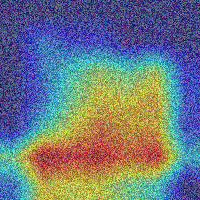

<!-- Banner-style README based on provided screenshot -->
<p align="center">
  
</p>

<p align="center">
  <a href="#">English</a> • <a href="#">简体中文</a> • <a href="#">繁體中文</a> • <a href="#">日本語</a> • <a href="#">한국어</a>
</p>

<p align="center">
  <a href="https://github.com/hrbzhq/NeuroMuscleAI-MVP/actions/workflows/ci.yml"></a>
  <a href="https://github.com/hrbzhq/NeuroMuscleAI-MVP/releases"></a>
  <a href="https://github.com/hrbzhq/NeuroMuscleAI-MVP/network/dependabot"></a>
  <a href="LICENSE"></a>
</p>

---

## Document | Roadmap | Twitter | Demo

NeuroMuscleAI-MVP 是一个用于肌电/神经影像小样本训练与可视化的演示级项目：包含训练脚本、Grad-CAM 可视化、Streamlit 演示与多语言支持。

快速开始

- Demo: `demo_run.py` 展示了如何用示例图像运行模型并导出 Grad-CAM。
- 前端: `app.py` 使用 Streamlit 提供交互式演示。
- 训练: `train.py` 包含训练循环与保存/加载逻辑。

### Table of Contents

- [What is NeuroMuscleAI-MVP](#what-is-neuromuscleai-mvp)
- [Demo](#demo)
- [Latest Updates](#latest-updates)
- [Key Features](#key-features)
- [System Architecture](#system-architecture)
- [Get Started](#get-started)
- [Configurations](#configurations)
- [Build & Run](#build--run)
- [Contributing](#contributing)
- [License](#license)

---

## What is NeuroMuscleAI-MVP

NeuroMuscleAI-MVP 展示了一个小规模的研究原型，用于探索使用 CNN（ResNet-18）在肌电/神经图像数据上的迁移学习、可解释性（Grad-CAM）以及轻量化前端演示。

## Demo

在本仓库中运行演示：

```powershell
python demo_run.py --input examples/sample.jpg --output out.png
streamlit run app.py
```

## Latest Updates

- 已加入 pre-commit（Black/isort/flake8）和 GitHub Actions CI。
- 添加了 `tools/network_fallback/` 用于在无法直接推送到 GitHub 时导出 `repo.bundle` 和补丁。

## Key Features

- 训练与评估脚本（`train.py`）
- 轻量模型（ResNet-18）与检查点加载（`model.py`）
- Grad-CAM 可视化工具（`utils.py`）
- Streamlit 演示页面（`app.py`）
- 多语言支持与国际化（`i18n.py`）

## System Architecture

项目使用 PyTorch 作为训练后端，Streamlit 提供前端，CI 使用 GitHub Actions。开发者工具链包括 `pre-commit`, `flake8`, `black`, `isort` 等。

## Get Started

1. 克隆仓库并创建虚拟环境：

```powershell
git clone https://github.com/hrbzhq/NeuroMuscleAI-MVP.git
python -m venv .venv
.\.venv\Scripts\Activate.ps1
pip install -r requirements.txt
```

2. 运行演示：

```powershell
streamlit run app.py
```

## Configurations

编辑 `config.yaml`（如果存在）来修改训练参数与演示选项。

## Build & Run

运行测试：

```powershell
pytest -q
```

## Contributing

请阅读 `CONTRIBUTING.md` 并在提交 PR 前运行：

```powershell
pre-commit run --all-files
```

---

## License

This project is licensed under the Apache-2.0 License - see the `LICENSE` file for details.
# NeuroMuscleAI-MVP

AI 识别肌肉衰退图像的开源原型 · Beginnings 生态系统

发起人: beginningstone

## 目标
构建一个可运行的 MVP，用于对肌肉组织图像进行“正常 / 衰退”二分类，并提供可视化与训练日志记录。项目面向高校与科研院所，支持本地部署与扩展。

## 快速开始
1. 创建并激活 Python 环境（建议 Python 3.8+）

```powershell
python -m venv .venv; .\.venv\Scripts\Activate.ps1
pip install -r requirements.txt
streamlit run app.py
```

## 文件结构
- `app.py` - Streamlit 前端原型
- `model.py` - 模型构建与加载
- `train.py` - 训练脚本
- `utils.py` - 工具函数（预处理、可视化、Grad-CAM 等）
- `config.yaml` - 实验配置
- `requirements.txt` - 依赖

## 许可证
MIT License

## 示例输出
下面展示从一次短跑 k-fold 演示中保存的 Grad-CAM 叠加样例（位于 `logs/` 目录）。这些图像用于展示模型关注区域，便于开源演示与结果复现。

示例图（来自 `logs/`）：


下面是自动生成的 demo 叠加示例（由 `demo_run.py` 生成并保存为 `logs/demo_overlay.jpg`）。该图展示了当前仓库中 `models/best_model.pth` 在一张合成样本上的 Grad-CAM 叠加结果，用以快速验证推理与可视化流程是否工作：



说明：如果本地没有 `models/best_model.pth`，脚本会使用随机初始化模型生成叠加图，图像仅用于流程演示。

如何复现短跑（在项目根目录运行）：

```powershell
python -m venv .venv; .\.venv\Scripts\Activate.ps1
pip install -r requirements.txt
python train.py --config config.yaml --k_folds 3 --epochs 2
```

说明：运行结束后，模型权重将保存在 `models/`，日志与 Grad-CAM 样例存放在 `logs/`，分类报告为 `logs/fold{n}_report_epoch{e}.txt`。

## Demo 指南
下面是逐步演示如何在本地重现实验（包括 k-fold 演示、可选的 wandb 接入，以及如何在 Streamlit 前端加载并展示 `best_model.pth`）。所有命令为 PowerShell 风格，适用于 Windows。

1) 环境准备

```powershell
# 创建并激活虚拟环境
python -m venv .venv
.\.venv\Scripts\Activate.ps1

# 安装依赖
pip install -r requirements.txt
```

2) 运行 k-fold 演示（短跑示例）

```powershell
# 在项目根运行一个小规模示例（例如 k=3, epochs=2）用于快速验证
python train.py --config config.yaml --k_folds 3 --epochs 2

# 运行结束后检查产物：
dir models
dir logs
```

说明：训练脚本会把每折的最佳权重保存在 `models/best_model_fold{n}.pth`，并在最后保存 `models/model_final.pth`。日志（TensorBoard）保存在 `logs/`。

3) 启用 Weights & Biases（可选）

1. 注册并获取 API Key：到 https://wandb.ai 注册并在 Settings 中拷贝 API Key。
2. 在本地登录（仅需一次）：

```powershell
wandb login <YOUR_API_KEY>
```

3. 在 `config.yaml` 中把 `use_wandb` 设置为 `True`：

```yaml
use_wandb: True
experiment_name: "muscle_atrophy_v1"
```

4. 重新运行 `train.py`，训练过程中的指标与 Grad-CAM 图片将被上报到 wandb（如果网络与登录正常）。

注意：如果不希望在公共项目中暴露 API Key，请使用本地 CI secret 或系统环境变量。

4) 在 Streamlit 中加载 `best_model.pth`

`app.py` 在启动时会尝试加载 `models/best_model.pth` 或 `models/model_final.pth`（如果存在）。要在 Streamlit 中加载并演示：

```powershell
# 启动 Streamlit 前端
streamlit run app.py

# 在网页中上传图像，点击 Predict/Grad-CAM 按钮即可查看预测与热力图叠加。
```

如果您想指定某个特定的权重文件，可以在 `app.py` 中修改加载路径或在 UI 中添加一个文件选择逻辑（目前程序会优先读取 `models/best_model.pth`）。

5) 常见故障与调试提示
- 如果训练时报 `ModuleNotFoundError` 或缺少包，请确保虚拟环境已激活并运行 `pip install -r requirements.txt`。
- 如果 wandb 上传失败，请检查网络与 `wandb login` 状态；也可以暂时把 `use_wandb` 设为 `False`。
- Grad-CAM 报错通常与模型结构（没有 Conv2d 层）或输入尺寸不符有关；确保使用 `model.build_model(pretrained=True)` 的默认 ResNet18 或调整 `utils.grad_cam` 的层选择逻辑。

欢迎把这个项目 Fork 到 GitHub 并在 Issues 中提交问题或改进建议。我们建议在推送到远端前确认 `.gitignore` 已正确忽略 `models/`, `logs/`, `data/` 等大文件目录。

发布指南：请参考 `RELEASE.md`，其中包含如何打 tag、创建 Release、以及如何安全地处理模型权重和大文件的建议。

提交成果与展示
----------------
项目现在包含一个简单的提交入口与展示工作流：

- 提交工具（本地/网页）：`tools/submit_results.py` 是一个轻量的 Streamlit 应用，贡献者可以上传 `predictions.csv` 和 `metrics.json`，这些内容会保存到仓库的 `submissions/` 目录。
- 自动展示：仓库包含一个 GitHub Actions 工作流 `publish_results.yml`，当 `master/main` 有推送时会把 `submissions/` 目录的内容发布到 GitHub Pages（`gh-pages`），从而在仓库的 Pages 页面上展示提交成果。

如何使用提交工具（本地运行）：

```powershell
python -m venv .venv
.\.venv\Scripts\Activate.ps1
pip install -r requirements.txt
streamlit run tools/submit_results.py
```

维护者提示：请在合并或审核提交后检查 `submissions/` 目录并决定是否把条目加入 README/leaderboard 或发布为 Release 附件。

Contributing — 本地设置 pre-commit
----------------------------------

为了保持代码风格一致并避免样式回归，项目使用 `pre-commit` 钩子运行 `black`, `isort`, 和 `flake8`。建议每位贡献者在本地启用：

1. 安装 `pre-commit`（在虚拟环境中执行）：

```powershell
pip install pre-commit
```

2. 在项目根启用钩子（只需一次）：

```powershell
pre-commit install
```

3. 在提交前或手动运行所有钩子：

```powershell
pre-commit run --all-files
```

CI（GitHub Actions）也会运行 `pre-commit` 以阻止不合格的提交被合并。若你希望 CI 自动修复样式，请在 PR 描述中说明并由维护者决定是否合并自动修复的提交。

如果你遇到 `flake8` 报错，先运行 `pre-commit run --all-files`，大多数格式问题会被 `black` 或 `isort` 自动修复；剩余问题一般是代码质量警告，需要手动修复。

贡献类型说明
- `software`: 代码、工具、脚本或软件工程相关贡献（例如改进训练脚本、模型定义）。
- `medical`: 与医学专业相关的贡献（例如影像标注、临床解释、病例讨论）。
- `dataset`: 新的数据集或数据增强脚本。
- `model`: 训练好的模型权重或模型构建说明。
- `other`: 其他类型的贡献。

维护者可以在审核 `submissions/` 时按 `contribution_type` 字段来分类并将结果整理到项目文档或 leaderboard 页面。

---

English (Quick Start & Demo)
---------------------------

This repository provides a small prototype for muscle atrophy detection using a ResNet-based model and Grad-CAM visualization. Quick steps to run the demo locally:

```powershell
python -m venv .venv
.\.venv\Scripts\Activate.ps1
pip install -r requirements.txt
python train.py --config config.yaml --k_folds 3 --epochs 2
streamlit run app.py
```

Notes:
- The Streamlit app will attempt to load `models/best_model.pth` or `models/model_final.pth` if available.
- Demo overlay images are stored in `docs/` for README rendering; larger artifacts and model weights should be distributed via Releases or external storage.

日本語（簡易手順とデモ）
------------------------

本リポジトリは筋萎縮検出のプロトタイプを提供します。ローカルでデモを実行する簡単な手順：

```powershell
python -m venv .venv
.\.venv\Scripts\Activate.ps1
pip install -r requirements.txt
python train.py --config config.yaml --k_folds 3 --epochs 2
streamlit run app.py
```

注意点：
- Streamlit アプリは `models/best_model.pth` または `models/model_final.pth` を優先的に読み込みます（存在する場合）。
- README 表示用のデモ画像は `docs/` に置いてあります。大きな成果物や学習済みモデルは Release や外部ストレージ経由で配布してください。
